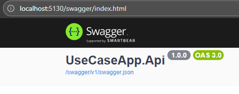
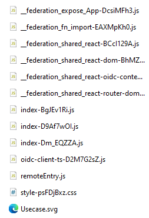
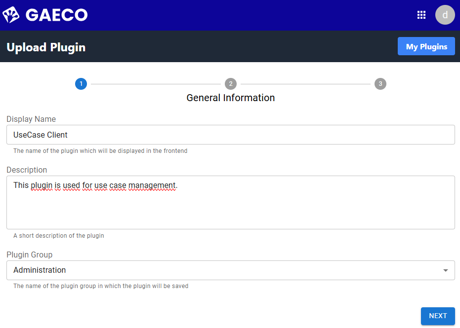
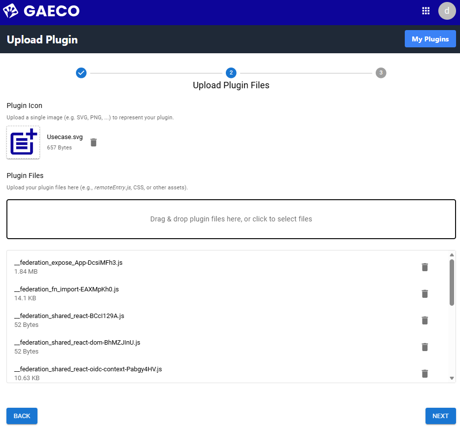
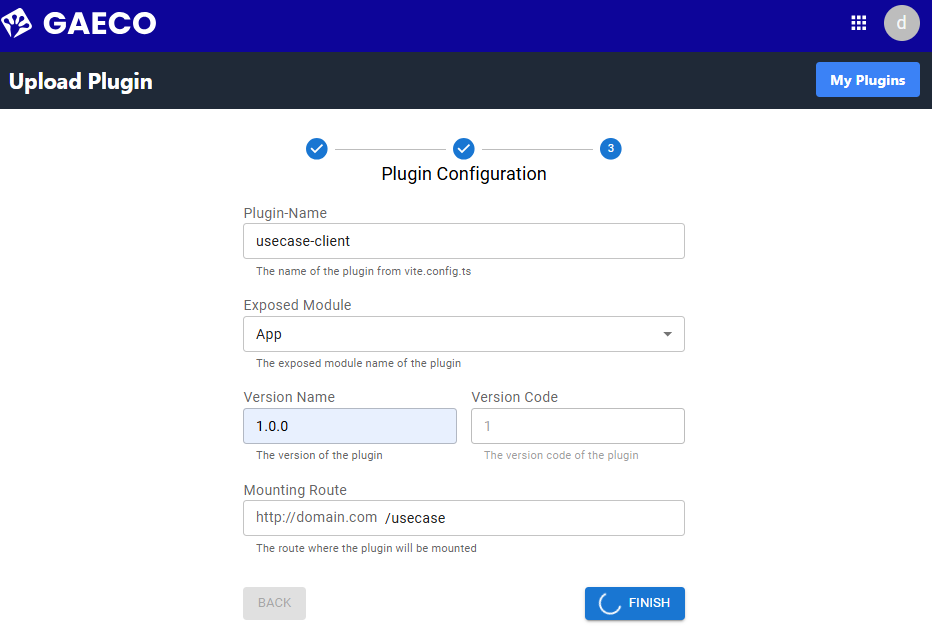
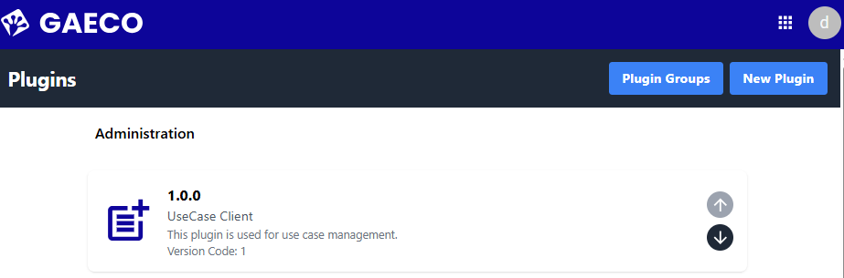

# Introduction

This document will guide you through the installation steps to start the UseCase Service in an organized manner.

# Prerequisites

- Ensure that the application `Docker Desktop` is running.
- Follow the installation instructions to locally set up:
  - `Keycloak`
  - `Kafka`
  - `MinIO`
  - `PluginHost Service`
  - `PluginManager`
- Make sure that `Node.js` version 11.4.1 or higher is installed on your computer.

# Technical Guide 

- There are two ways to set up this project. You only need to follow one of the setup options but you need access to the `Docker Image Hub` for both:
  - Click [here](#on-repository-access) on repository access when no docker compose files are provided.
  - Click [here](#on-image-access) when docker compose files are provided.

## On Repository Access

If you previously used the `start-all.bat` for project setup, you can ignore the following instructions and skip directly to [uploading the UseCase Plugin](#uploading-the-usecase-plugin).

- Clone your project into a local folder.
- Make sure your project is updated to the latest version.
- Navigate to `_docker/docker-compose-files/`
- Open your command line interface within your current working directory. On Windows, you can use either the `Terminal` or `PowerShell` by right-clicking while holding the `Shift` key and selecting the option that corresponds to your command line interface.
- Execute the following command: `docker compose -p usecase-service -f docker-compose.yml -f docker‐compose-override.yml up -d`.

If you can access `localhost:5130/swagger` your UseCaseService Server is now ready for use. 

The project utilizes a microfrontend architecture. To use the client:
- Navigate to `gaeco/UseCaseService/UseCaseApp.Client`
- Open your command line interface within your current working directory. On Windows, you can use either the `Terminal` or `PowerShell` by right-clicking while holding the `Shift` key and selecting the option that corresponds to your command line interface.
- Execute `npm i` and `npm run build:devlocal`. This will generate the plugin files inside `gaeco/UseCaseService/UseCaseApp.Client/dist`
- Now please follow these instructions for [uploading the UseCase Plugin](#uploading-the-usecase-plugin).

## On Image Access

If you previously used the `start-all.bat` for project setup, you can ignore the following instructions and skip directly to [uploading the UseCase Plugin](#uploading-the-usecase-plugin).

To start the project you should have three files inside the same folder: `.env`, `docker-compose.yml`, and `docker-compose-override.yml`. The contents of these files are not essential for local setup. 

Additionally, you should have the built UseCase Client, which consists of several `.js` files, one `.svg` and one `.css` file.

- Open your command line interface within your current working directory. On Windows, you can use either the `Terminal` or `PowerShell` by right-clicking while holding the `Shift` key and selecting the option that corresponds to your command line interface.
- Execute the following command: `docker compose -p usecase-service -f docker-compose.yml -f docker‐compose-override.yml up -d`.

If you can access `localhost:5130/swagger` your UseCaseService Server is now ready for use. 

Now please follow these instructions for [uploading the UseCase Plugin](#uploading-the-usecase-plugin).

## Uploading the UseCase Plugin

You can now upload the built plugin via the Plugin Manager, as specified in the user documentation of the Plugin Manager. The creation of a `Plugin Group` is required first, and the process should resemble the following:

1. Set general information for the UseCase Plugin. 

2. Upload built files of the UseCase Plugin. 

3. Configure settings for the UseCase plugin. 

4.  The uploaded UseCase Plugin will appear in the Plugin Manager. 

If your Plugin Manager looks like step 4, you are ready to use the Use Case Client.