# Introduction

This document guides you through the UseCases module: where the working contexts of a gaeco
platform are defined.

A UseCase is the context that data is viewed and edited from. gaeco never shows simply all the
data — every view and every permission is bound to a UseCase. Energy management and maintenance
planning can address the same building and expose different parts of it: the building is stored
once, and the UseCase decides which section is relevant.

Creating one is the second of the three setup steps the
[start page](https://github.com/gaeco-ekkodale/Homepage) asks for. It has to happen before
access rights can be configured, because rights are always granted *within* a UseCase.

# Prerequisites

- The `UseCase Client` must be running as a plugin inside the Plugin Host.
- The `UseCase Server` and `UseCase Postgres` must be running.
- The following services must also be running:
  - `Keycloak`
  - `Kafka`
  - `MiniO`
  - `PluginHost Service`
  - `AppOrchestrator`

# General Usage

The module is a table of the configured contexts, with a name and a description each.

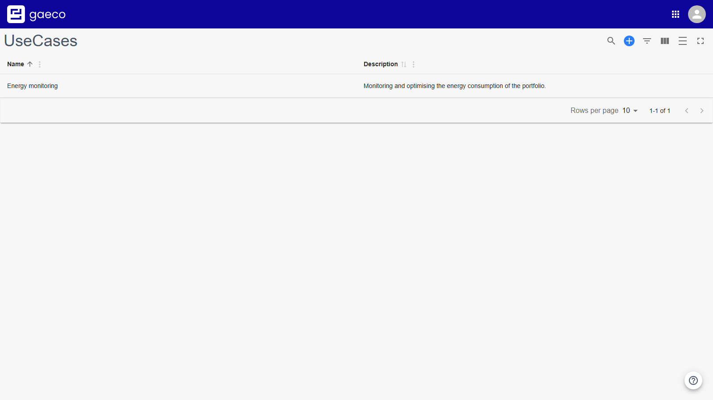

It provides features to:

- [add a UseCase](#adding-a-usecase)
- [edit an existing one](#editing-a-usecase)
- [search, filter and arrange the table](#finding-and-arranging)

# Adding a UseCase

On a platform that already has UseCases, the control is in the table toolbar. On an empty
platform the module offers a prominent **Create UseCase** button instead.

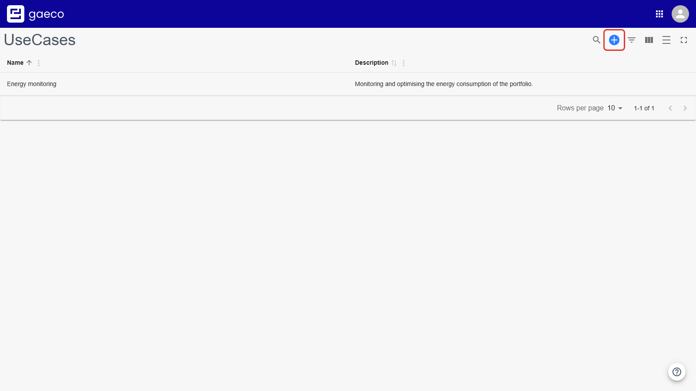

A dialog asks for a name and a description. Both are required.

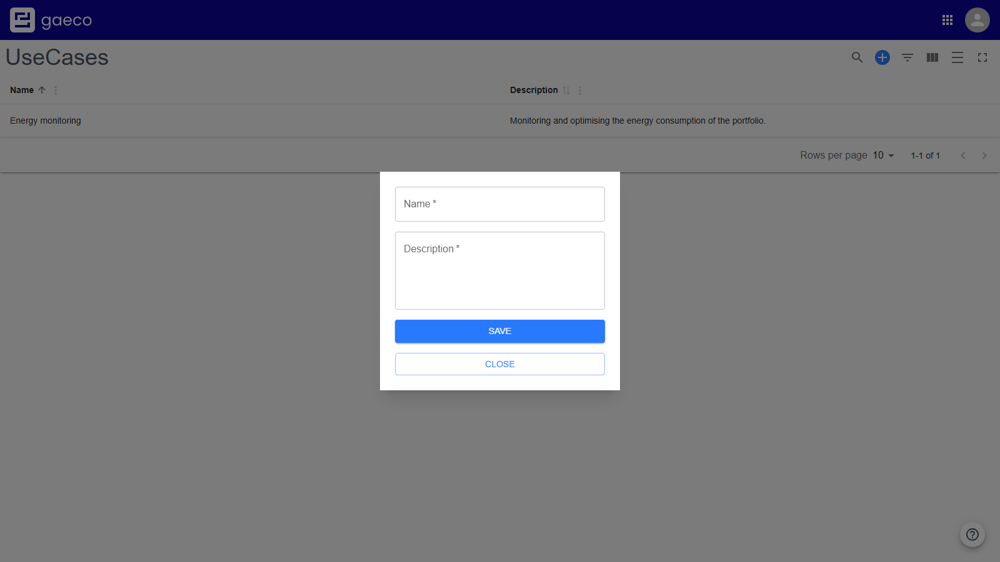

## Choosing a Good Name

This is worth a moment's thought, because the name is what everyone chooses from later, in every
other module's UseCase selector.

Name a UseCase after **the task it serves**, not after a department or a team — "Energy
monitoring", "Maintenance planning", "Space management". A UseCase called "Facility Management
Team" says nothing about what the context is for, and stops being accurate the moment the team is
renamed.

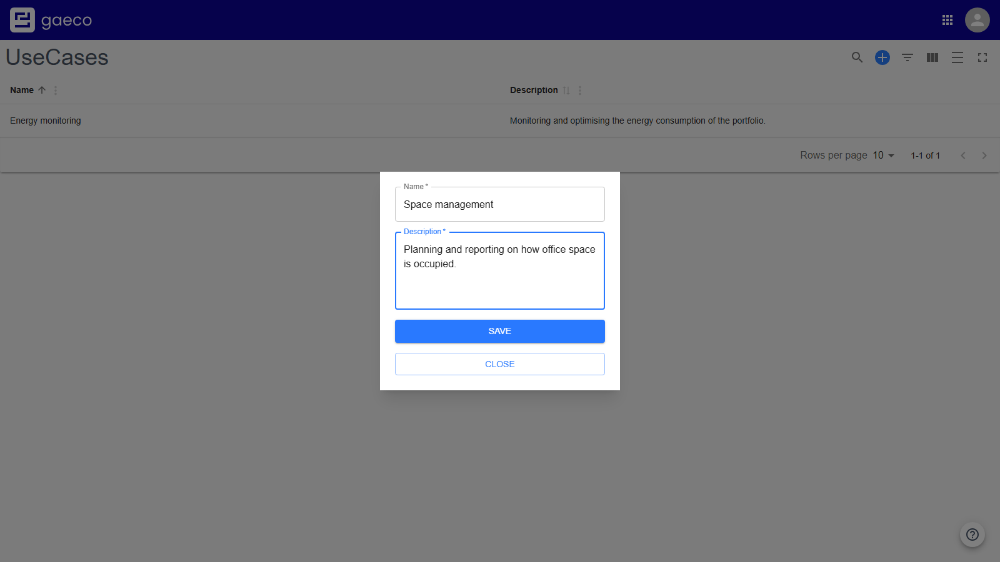

**Save** adds it to the table.

# Editing a UseCase

Editing happens in place. Double-click a cell to change it; the change applies when the field
loses focus — press `Enter`, `Tab`, or click outside the cell.

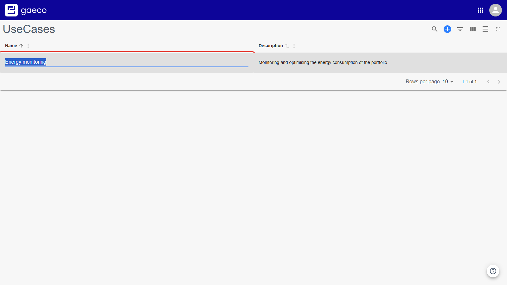

Renaming a UseCase does not affect the data or the permissions attached to it: those refer to its
identifier, not its name.

# Finding and Arranging

The toolbar holds the table controls.

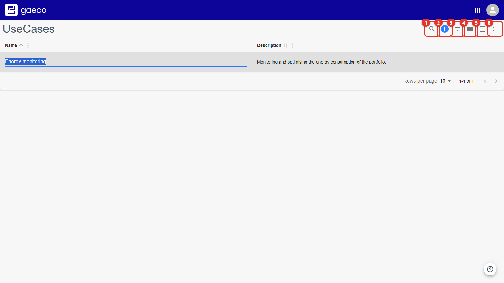

| # | Control | Purpose |
| --- | --- | --- |
| 1 | Search | Filter across all columns |
| 2 | Add UseCase | Create a new context |
| 3 | Column filters | Filter each column separately |
| 4 | Columns | Show or hide individual columns |
| 5 | Density | Change the row height |
| 6 | Full screen | Maximise the table in the viewport |

## Search

The search field filters the table as you type. Matching text is highlighted; rows that do not
match are hidden.

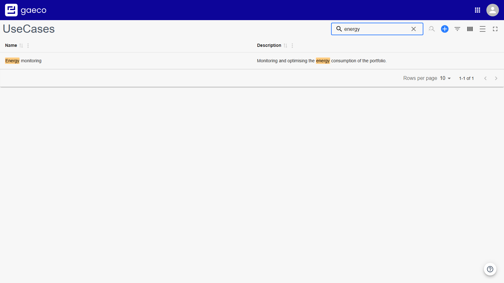

## Column Filters

For more precise results, each column can be filtered on its own, and the filters combine — a
name filter and a description filter apply together. The general search can be combined with
them as well.

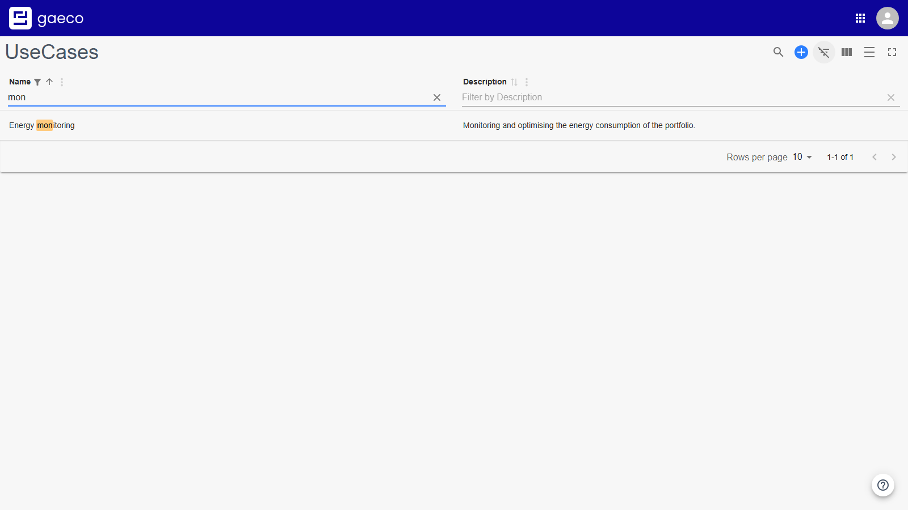

## Showing and Hiding Columns

Useful mainly for hiding the description, which is long.

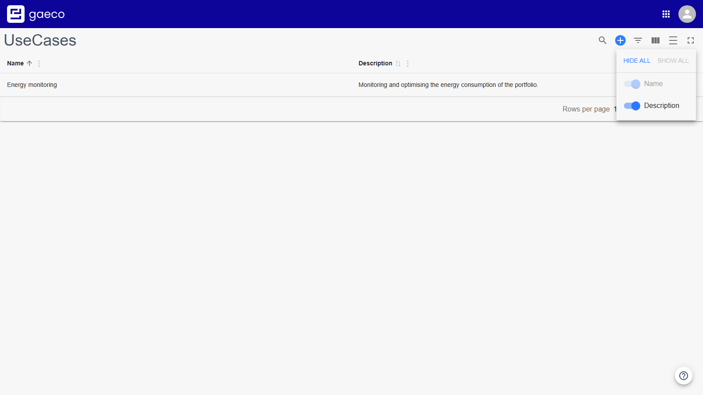

## Density

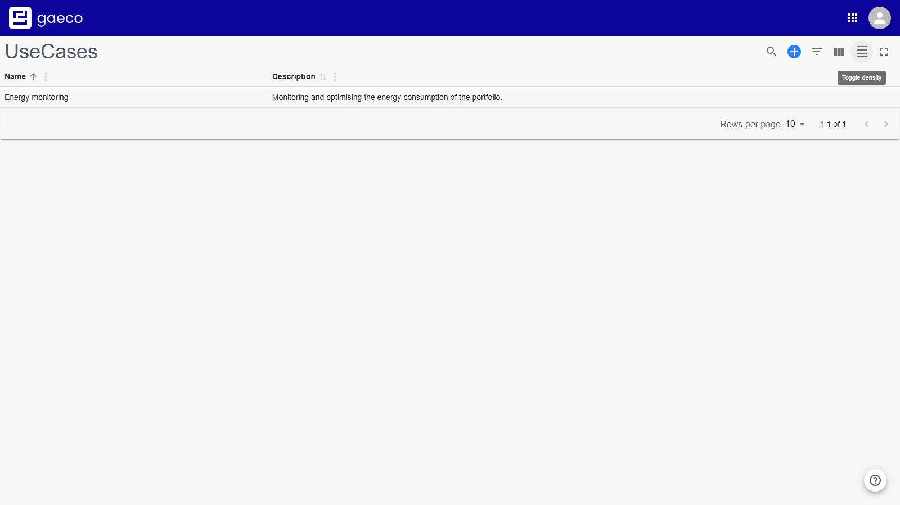

## Full Screen

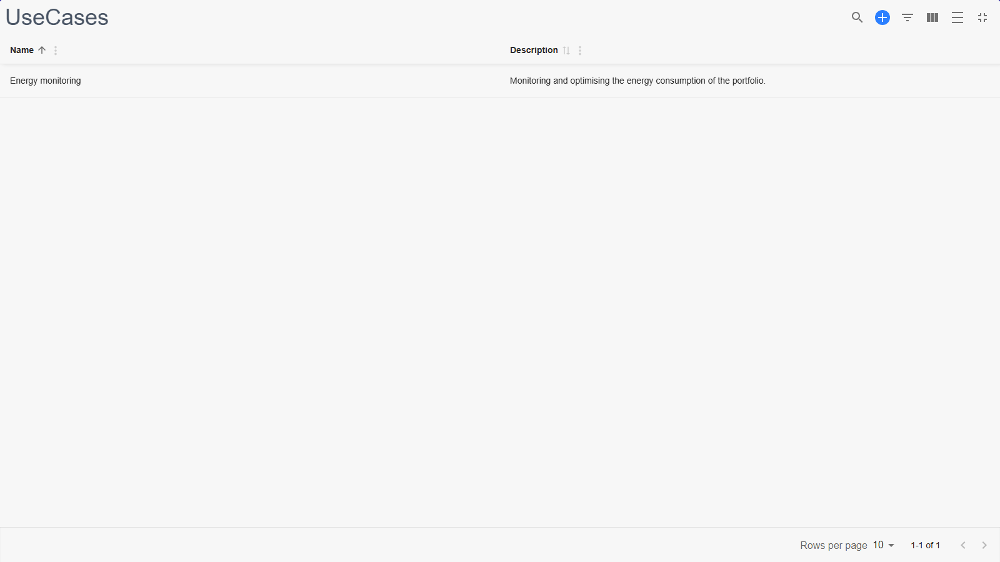

## Pagination

The table shows 10 rows per page by default, adjustable through the dropdown. Beside it the
current range and total are shown, and the arrows move between pages.

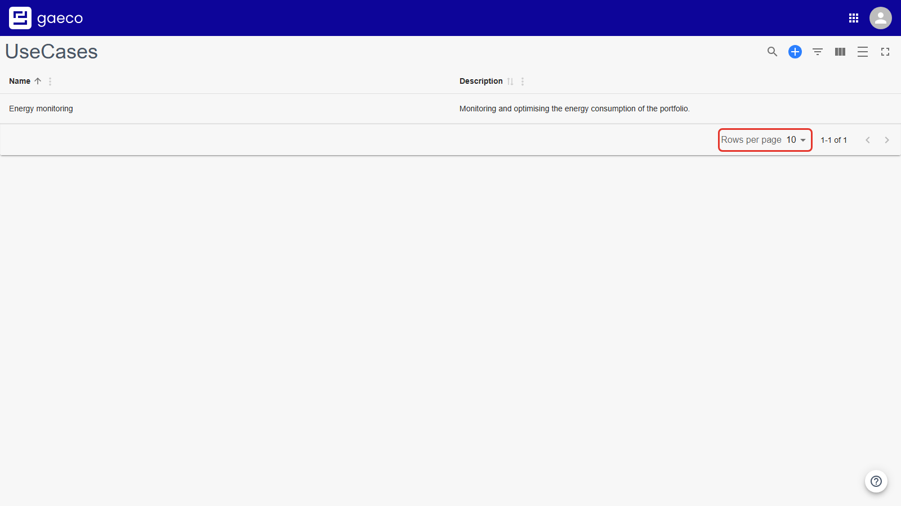

# The Built-in Tour

The help button replays the module's own explanation at any time.

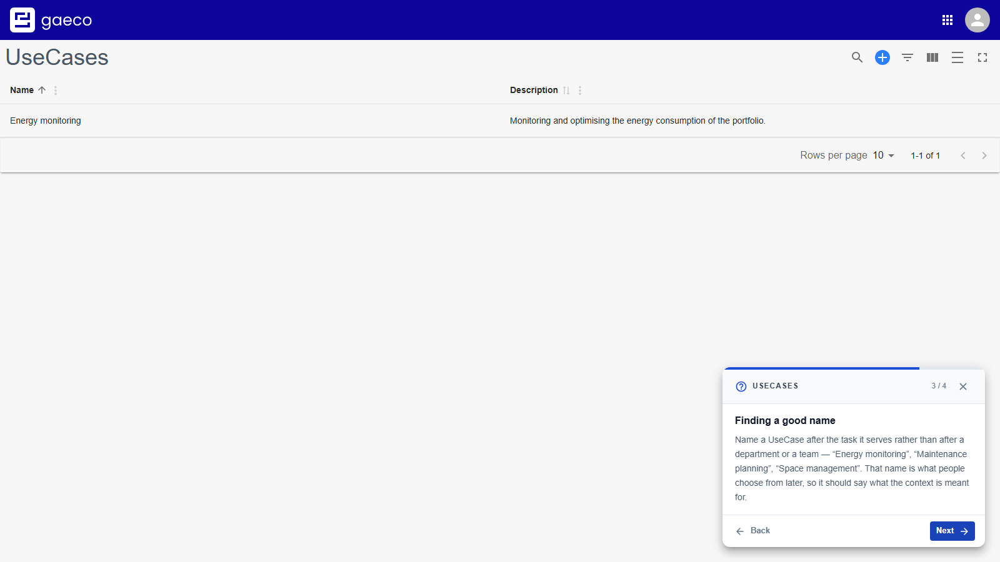

# Deleting a UseCase

Deleting a UseCase is deliberately not offered in this module. A UseCase is referenced by the
access rights configured for it and by the data created under it, so removing one is not a local
operation. Retire a context by taking its permissions away in the
[Access Rights module](https://github.com/gaeco-ekkodale/AccessService) instead.

# For Developers

The UseCase Service publishes its changes via Kafka, so other services can react to a UseCase
being created or renamed. See the [developer documentation](../developer/01-Concepts.md).

# Related Documentation

- The deployment repository's user guide — all three setup steps in order
- [Access Rights](https://github.com/gaeco-ekkodale/AccessService) — the next setup step
- [Instances](https://github.com/gaeco-ekkodale/InstanceService) — where data is created
  within a UseCase
